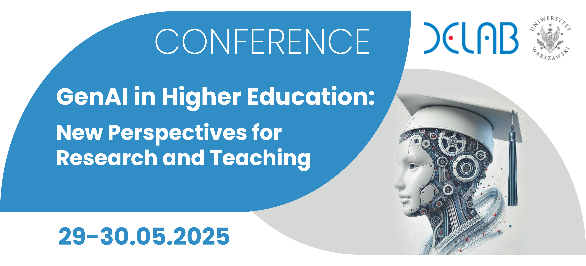

<!-- Sekcja lokalizacji -->

        
            <!-- Ikona lokalizacji (np. Font Awesome lub inna) -->
            <svg xmlns="http://www.w3.org/2000/svg" height="45" viewBox="0 0 24 24" width="45" fill="#888888"><path d="M12 2C8.13 2 5 5.13 5 9c0 5.25 7 13 7 13s7-7.75 7-13c0-3.87-3.13-7-7-7zm0 9.5c-1.38 0-2.5-1.12-2.5-2.5s1.12-2.5 2.5-2.5 2.5 1.12 2.5 2.5-1.12 2.5-2.5 2.5z"></path></svg>
        
        Uniwersytet Warszawski, Wydział Neofilologii Warszawa, ul. Dobra 55
        University of Warsaw, Faculty of Neophilology, Warsaw, ul. Dobra 55

 

<!-- Nagłówek -->
<h1>
    <b>Weź udział w konferencji i stań się częścią rewolucji w nauce i edukacji!</b>
    <b>Join the conference and be part of the revolution in science and education!</b>
</h1>

<!-- Przycisk rejestracji-->

    <!-- Przycisk rejestracji -->
    <a href="#register" class="info-button">
        Zarejestruj się teraz
        Register now
    </a>
    <!-- Przycisk Call for Papers -->
    <a href="#call" class="info-button">
        Call for papers
        Call for papers
    </a>

<!-- Timer -->
<!DOCTYPE html>
<html lang="en">
<head>
    <meta charset="UTF-8">
    <meta name="viewport" content="width=device-width, initial-scale=1.0">
    <title>Countdown Timer</title>
    
</head>
<body>
    

        

            Konferencja rozpocznie się już za:
            The conference starts in:
        

        <!-- Timer liczb -->
        

            

                0
            

            

                0
            

            

                0
            

            

                0
            

        

        <!-- Etykiety dla wartości -->
        

            

                Dni
                Days
            

            

                Godziny
                Hours
            

            

                Minuty
                Minutes
            

            

                Sekundy
                Seconds
            

        

    

</body>
</html>

 

<!-- Opis -->
<link href="https://cdnjs.cloudflare.com/ajax/libs/font-awesome/6.0.0/css/all.min.css" rel="stylesheet">

    
<!-- Nagłówek sekcji -->

    O konferencji GenAI w edukacji wyższej
    About the GenAI Conference in Higher Education

    

        Poznaj możliwości generatywnej sztucznej inteligencji w edukacji i nauce! Konferencja GenAI to miejsce, gdzie liderzy, badacze i praktycy spotykają się, aby omówić przyszłość technologii AI w kształtowaniu dydaktyki i badań naukowych.
        Explore the possibilities of generative AI in education and science! The GenAI conference is a place where leaders, researchers and practitioners meet to discuss the future of AI technologies in shaping teaching and research.
    

<!-- Sekcja obszarów tematycznych -->

        <!-- Obszar tematyczny 1 -->
        

            

                <i class="fas fa-globe" style="color: #2c84c9; font-size: 24px;"></i>
            

            

                <h3>
                Nowoczesna dydaktyka
                Modern didactics
                </h3>
                

                Jak generatywna AI zmienia sposób nauczania i uczenia się.
                How generative AI is changing the way we teach and learn.
                

            

        

        
<!-- Obszar tematyczny 2 -->

            

                <i class="fas fa-microscope" style="color: #2c84c9; font-size: 24px;"></i>
            

            

                <h3>
                Innowacyjne badania naukowe
                Innovative research
                </h3>
                

                Przełomowe zastosowania AI w nauce i badaniach.
                Groundbreaking applications of AI in science and research.
                

            

<!-- Obszar tematyczny 3 -->

            

                <i class="fas fa-university" style="color: #2c84c9; font-size: 24px;"></i>
            

            

                <h3>
                Dobre praktyki w edukacji
                Best practices in education
                </h3>
                

                Inspirujące przykłady wdrożeń technologii na uczelniach.
                Inspiring examples of technology implementations at universities.
                

            

        

<!-- Obszar tematyczny 4 -->

            

                <i class="fas fa-handshake" style="color: #2c84c9; font-size: 24px;"></i>
            

            

                <h3>
                Budowanie portalu wiedzy
                Building a knowledge portal
                </h3>
                

                Tworzenie platformy wymiany doświadczeń między badaczami, firmami i dydaktykami.
                Creating a platform for the exchange of experiences between researchers, companies and educators.
                

            

        

    

 

<!-- Agenda -->

<h1 id="harmonogram" style="margin-top: 50px;">
    <b>Harmonogram wydarzenia</b>
    <b>Event Schedule</b></h1>

<!DOCTYPE html>
<html lang="en">
<head>
    <meta charset="UTF-8">
    <meta name="viewport" content="width=device-width, initial-scale=1.0">
</head>
<body>
    

        <!-- Bloki z dniami -->
        

            

                
                    Dzień 1
                    Day 1
                 
                
                    czwartek 29.05
                    Thursday 29.05
                
            

            

                
                    Dzień 2
                    Day 2
                 
                
                    piątek 30.05
                    Friday 30.05
                
            

        

        <!-- Harmonogram wyświetlany dynamicznie -->
        

            <h3> </h3>
            

                

                    
9:00-10:00

                        <svg xmlns="http://www.w3.org/2000/svg" height="16" viewBox="0 0 24 24" width="16" fill="#bbb" style="vertical-align: middle; margin-right: 5px;"><path d="M12 2C8.13 2 5 5.13 5 9c0 5.25 7 13 7 13s7-7.75 7-13c0-3.87-3.13-7-7-7zm0 9.5c-1.38 0-2.5-1.12-2.5-2.5s1.12-2.5 2.5-2.5 2.5 1.12 2.5 2.5-1.12 2.5-2.5 2.5z"></path></svg>
                        
                            Główna aula 0.410
                            Main hall 0.410
                            
                    

                        Otwarcie konferencji
                        Opening of the conference
                    
 
                

                

                    

                    Uroczyste przemówienie JM rektora
                    Ceremonial Address by His Magnificence the Rector
                     
                    Wystąpienia ministrów
                    Ministers' speeches
                     
                    Wystąpienie Dyrektor DELab UW
                    Speech by the Director of DELab UW
                    

                

            

            

                

                    
10:00-11:00

                    <svg xmlns="http://www.w3.org/2000/svg" height="16" viewBox="0 0 24 24" width="16" fill="#bbb" style="vertical-align: middle; margin-right: 5px;"><path d="M12 2C8.13 2 5 5.13 5 9c0 5.25 7 13 7 13s7-7.75 7-13c0-3.87-3.13-7-7-7zm0 9.5c-1.38 0-2.5-1.12-2.5-2.5s1.12-2.5 2.5-2.5 2.5 1.12 2.5 2.5-1.12 2.5-2.5 2.5z"></path></svg>
                        
                            Główna aula 0.410
                            Main hall 0.410
                        
                    
Keynote Speech

                

                

                    

                    prof. Neil Selwyn (Monash University, Australia)
                    prof. Neil Selwyn (Monash University, Australia)
                     
                    Temat: Wpływ nowych technologii na edukację i naukę (TBC)
                    Topic: The impact of new technologies on education and science (TBC)
                    

                

            

            

                

                    
11:00-11:30

                    

                

                

                    

                    Przerwa kawowa
                    Coffee break
                    

                

            

            

                

                    
11:30 - 13:00

                    

                        Sesje równoległe
                        Parallel sessions
                    

                

                

                    

                    <b>Nauka i Badania</b>
                    <b>Science and Research</b>
                     
                    <svg xmlns="http://www.w3.org/2000/svg" height="16" viewBox="0 0 24 24" width="16" fill="#bbb" style="vertical-align: middle; margin-right: 5px;"><path d="M12 2C8.13 2 5 5.13 5 9c0 5.25 7 13 7 13s7-7.75 7-13c0-3.87-3.13-7-7-7zm0 9.5c-1.38 0-2.5-1.12-2.5-2.5s1.12-2.5 2.5-2.5 2.5 1.12 2.5 2.5-1.12 2.5-2.5 2.5z"></path></svg>
                        
                            Sala: 1.132
                            Room: 1.132
                        
                         
                        Temat: Nowe paradygmaty badawcze w erze cyfrowej
                        Topic: New research paradigms in the digital era
                         
                     
                    <b>Dydaktyka</b>
                    <b>Didactics</b>
                     <svg xmlns="http://www.w3.org/2000/svg" height="16" viewBox="0 0 24 24" width="16" fill="#bbb" style="vertical-align: middle; margin-right: 5px;"><path d="M12 2C8.13 2 5 5.13 5 9c0 5.25 7 13 7 13s7-7.75 7-13c0-3.87-3.13-7-7-7zm0 9.5c-1.38 0-2.5-1.12-2.5-2.5s1.12-2.5 2.5-2.5 2.5 1.12 2.5 2.5-1.12 2.5-2.5 2.5z"></path></svg>
                        
                        Sala: 1.138
                        Room: 1.138
                        
                         
                        Temat: Nowe podejścia edukacyjne w erze cyfrowej
                        Topic: New educational approaches in the digital era
                     
                     
                    <b>Otoczenie uczelni</b>
                    <b>University ecosystem</b>
                     
                    <svg xmlns="http://www.w3.org/2000/svg" height="16" viewBox="0 0 24 24" width="16" fill="#bbb" style="vertical-align: middle; margin-right: 5px;"><path d="M12 2C8.13 2 5 5.13 5 9c0 5.25 7 13 7 13s7-7.75 7-13c0-3.87-3.13-7-7-7zm0 9.5c-1.38 0-2.5-1.12-2.5-2.5s1.12-2.5 2.5-2.5 2.5 1.12 2.5 2.5-1.12 2.5-2.5 2.5z"></path></svg>
                        
                        Sala: 1.128
                        Room: 1.128
                        
                         
                        Temat: Nowe wzorce współpracy w erze cyfrowej
                        Topic: New patterns of collaboration in digital era 
                         
                

            

            

                

                    
13:00 - 14:00

                    
 

                

                

                    
Lunch

                

            

            

                

                    
14:00 - 15:30

                    

                    

                

                

                    <b>Warsztaty</b>
                    <b>Workshops</b>
                     
                     
                    <svg xmlns="http://www.w3.org/2000/svg" height="16" viewBox="0 0 24 24" width="16" fill="#bbb" style="vertical-align: middle; margin-right: 5px;"><path d="M12 2C8.13 2 5 5.13 5 9c0 5.25 7 13 7 13s7-7.75 7-13c0-3.87-3.13-7-7-7zm0 9.5c-1.38 0-2.5-1.12-2.5-2.5s1.12-2.5 2.5-2.5 2.5 1.12 2.5 2.5-1.12 2.5-2.5 2.5z"></path></svg>
                    
                        Sala: 1.132
                        Room: 1.132
                    
                     
                    Temat: Automatyzacja procesów badawczych
                    Topic: Automation of research processes
                      
                    <svg xmlns="http://www.w3.org/2000/svg" height="16" viewBox="0 0 24 24" width="16" fill="#bbb" style="vertical-align: middle; margin-right: 5px;"><path d="M12 2C8.13 2 5 5.13 5 9c0 5.25 7 13 7 13s7-7.75 7-13c0-3.87-3.13-7-7-7zm0 9.5c-1.38 0-2.5-1.12-2.5-2.5s1.12-2.5 2.5-2.5 2.5 1.12 2.5 2.5-1.12 2.5-2.5 2.5z"></path></svg>
                    
                        Sala: 1.138
                        Room: 1.138
                     
                    Temat: Włączanie nowych narzędzi cyfrowych w procesy dydaktyczne
                    Topic: Incorporating new digital tools into teaching processes
                     
                     
                     
                    <b>Dyskusje</b>
                    <b>Discussions</b>
                     
                     
                    <svg xmlns="http://www.w3.org/2000/svg" height="16" viewBox="0 0 24 24" width="16" fill="#bbb" style="vertical-align: middle; margin-right: 5px;"><path d="M12 2C8.13 2 5 5.13 5 9c0 5.25 7 13 7 13s7-7.75 7-13c0-3.87-3.13-7-7-7zm0 9.5c-1.38 0-2.5-1.12-2.5-2.5s1.12-2.5 2.5-2.5 2.5 1.12 2.5 2.5-1.12 2.5-2.5 2.5z"></path></svg>
                    Sala: 1.128
                    Room: 1.128
                     
                    Temat: EdTechs w szkolnictwie wyższym. Możliwości i wyzwania
                    Topic: EdTechs in higher education. Opportunities and challenges
                     
                     
                    <svg xmlns="http://www.w3.org/2000/svg" height="16" viewBox="0 0 24 24" width="16" fill="#bbb" style="vertical-align: middle; margin-right: 5px;"><path d="M12 2C8.13 2 5 5.13 5 9c0 5.25 7 13 7 13s7-7.75 7-13c0-3.87-3.13-7-7-7zm0 9.5c-1.38 0-2.5-1.12-2.5-2.5s1.12-2.5 2.5-2.5 2.5 1.12 2.5 2.5-1.12 2.5-2.5 2.5z"></path></svg>
                    Główna aula 0.410
                    Main hall 0.410
                     
                    Temat: 
                    Topic: 
                

            

            

                

                    
15:30 - 16:00

                    
 

                

                

                    

                    Przerwa kawowa
                    Coffee break
                    

                

            

            

                

                    
16:00 - 17:30

                    <svg xmlns="http://www.w3.org/2000/svg" height="16" viewBox="0 0 24 24" width="16" fill="#bbb" style="vertical-align: middle; margin-right: 5px;"><path d="M12 2C8.13 2 5 5.13 5 9c0 5.25 7 13 7 13s7-7.75 7-13c0-3.87-3.13-7-7-7zm0 9.5c-1.38 0-2.5-1.12-2.5-2.5s1.12-2.5 2.5-2.5 2.5 1.12 2.5 2.5-1.12 2.5-2.5 2.5z"></path></svg>
                    
                    Główna aula 0.410
                    Main hall 0.410
                    
                    

                        Panel Dyskusyjny
                        Discussion Panel
                    

                

                

                    

                    Temat: W kierunku nowego ekosystemu badań i edukacji w środowisku akademickim
                    Topic: Towards new research and education ecosystem in academia
                    

                

            

            

                

                    
19:00-22:00

                    <svg xmlns="http://www.w3.org/2000/svg" height="16" viewBox="0 0 24 24" width="16" fill="#bbb" style="vertical-align: middle; margin-right: 5px;"><path d="M12 2C8.13 2 5 5.13 5 9c0 5.25 7 13 7 13s7-7.75 7-13c0-3.87-3.13-7-7-7zm0 9.5c-1.38 0-2.5-1.12-2.5-2.5s1.12-2.5 2.5-2.5 2.5 1.12 2.5 2.5-1.12 2.5-2.5 2.5z"></path></svg>
                    
                    Sale Muzeum Uniwersytetu Warszawskiego
                    Halls of the University of Warsaw Museum
                    
                    
 

                

                

                    

                    <b>Kolacja bankietowa</b>
                    <b>Banquet Dinner</b>
                    

                

            

        

        

            <h3> </h3>
            

                

                    
9:00-10:30

                    

                    Sesje równoległe
                    Parallel sessions
                    

                

                

                    

                    <b>Nauka i Badania</b>
                    <b>Science and Research</b>
                     <svg xmlns="http://www.w3.org/2000/svg" height="16" viewBox="0 0 24 24" width="16" fill="#bbb" style="vertical-align: middle; margin-right: 5px;"><path d="M12 2C8.13 2 5 5.13 5 9c0 5.25 7 13 7 13s7-7.75 7-13c0-3.87-3.13-7-7-7zm0 9.5c-1.38 0-2.5-1.12-2.5-2.5s1.12-2.5 2.5-2.5 2.5 1.12 2.5 2.5-1.12 2.5-2.5 2.5z"></path></svg>
                    
                    Sala: 1.132
                    Room: 1.132
                    
                     
                    Temat: Przyszłość publikacji naukowych
                    Topic: The Future of Scientific Publishing
                      
                    <b>Dydaktyka</b>
                    <b>Didactics</b>
                     <svg xmlns="http://www.w3.org/2000/svg" height="16" viewBox="0 0 24 24" width="16" fill="#bbb" style="vertical-align: middle; margin-right: 5px;"><path d="M12 2C8.13 2 5 5.13 5 9c0 5.25 7 13 7 13s7-7.75 7-13c0-3.87-3.13-7-7-7zm0 9.5c-1.38 0-2.5-1.12-2.5-2.5s1.12-2.5 2.5-2.5 2.5 1.12 2.5 2.5-1.12 2.5-2.5 2.5z"></path></svg>
                    
                    Sala: 1.138
                    Room: 1.138
                    
                     
                    Temat: Innowacyjne metody nauczania
                    Topic: Innovative teaching methods
                    
 
                    <b>Praktyki i Wymiana Wiedzy</b>
                    <b>Practices and Knowledge Exchange</b>
                     <svg xmlns="http://www.w3.org/2000/svg" height="16" viewBox="0 0 24 24" width="16" fill="#bbb" style="vertical-align: middle; margin-right: 5px;"><path d="M12 2C8.13 2 5 5.13 5 9c0 5.25 7 13 7 13s7-7.75 7-13c0-3.87-3.13-7-7-7zm0 9.5c-1.38 0-2.5-1.12-2.5-2.5s1.12-2.5 2.5-2.5 2.5 1.12 2.5 2.5-1.12 2.5-2.5 2.5z"></path></svg>
                    
                    Sala: 1.128
                    Room: 1.128
                    
                     
                    Prezentacje sponsorów i praktyków
                    Presentations by Sponsors and Practitioners
                    

                

            

            

                

                    
10:30 - 11:00

                    
 

                

                

                    

                    Przerwa kawowa
                    Coffee break
                    

                

            

            

                

                    
11:30-12:30

                    

                    Warsztaty
                    Workshops
                    

                

                

                    <svg xmlns="http://www.w3.org/2000/svg" height="16" viewBox="0 0 24 24" width="16" fill="#bbb" style="vertical-align: middle; margin-right: 5px;"><path d="M12 2C8.13 2 5 5.13 5 9c0 5.25 7 13 7 13s7-7.75 7-13c0-3.87-3.13-7-7-7zm0 9.5c-1.38 0-2.5-1.12-2.5-2.5s1.12-2.5 2.5-2.5 2.5 1.12 2.5 2.5-1.12 2.5-2.5 2.5z"></path></svg>
                    
                    Sala: 1.132
                    Room: 1.132
                    
                     
                    Wykorzystanie AI w nauce
                    Using AI in science
                      
                    <svg xmlns="http://www.w3.org/2000/svg" height="16" viewBox="0 0 24 24" width="16" fill="#bbb" style="vertical-align: middle; margin-right: 5px;"><path d="M12 2C8.13 2 5 5.13 5 9c0 5.25 7 13 7 13s7-7.75 7-13c0-3.87-3.13-7-7-7zm0 9.5c-1.38 0-2.5-1.12-2.5-2.5s1.12-2.5 2.5-2.5 2.5 1.12 2.5 2.5-1.12 2.5-2.5 2.5z"></path></svg>
                    
                    Sala: 1.138
                    Room: 1.138
                    
                     
                    Nowe technologie w dydaktyce
                    New technologies in teaching
                

            

            

                

                    
12:30-13:30 

                    
 

                

                

                    
Lunch

                

            

            

                

                    
13:30 - 15:00

                    <svg xmlns="http://www.w3.org/2000/svg" height="16" viewBox="0 0 24 24" width="16" fill="#bbb" style="vertical-align: middle; margin-right: 5px;"><path d="M12 2C8.13 2 5 5.13 5 9c0 5.25 7 13 7 13s7-7.75 7-13c0-3.87-3.13-7-7-7zm0 9.5c-1.38 0-2.5-1.12-2.5-2.5s1.12-2.5 2.5-2.5 2.5 1.12 2.5 2.5-1.12 2.5-2.5 2.5z"></path></svg>
                    
                    Główna aula 0.410
                    Main hall 0.410
                     
                    

                    Panel Dyskusyjny
                    Discussion Panel
                    

                

                

                    

                    Temat: Przyszłość edukacji wyższej
                    Topic: The Future of Higher Education
                    

                

            

            

                

                    
15:00 - 15:30

                    <svg xmlns="http://www.w3.org/2000/svg" height="16" viewBox="0 0 24 24" width="16" fill="#bbb" style="vertical-align: middle; margin-right: 5px;"><path d="M12 2C8.13 2 5 5.13 5 9c0 5.25 7 13 7 13s7-7.75 7-13c0-3.87-3.13-7-7-7zm0 9.5c-1.38 0-2.5-1.12-2.5-2.5s1.12-2.5 2.5-2.5 2.5 1.12 2.5 2.5-1.12 2.5-2.5 2.5z"></path></svg>
                    
                    Główna aula 0.410
                    Main hall 0.410
                     
                    

                    Zamknięcie Konferencji
                    Closing of the Conference
                    

                

                

                    

                    Podsumowanie i wnioski
                    Summary and Conclusions
                    

                

            

        

    

    
</body>
</html>

    <ul style="list-style-type: disc; margin: 0; padding: 0 20px;">
        <li>
        <b>Stoiska partnerów:</b>
        <b>Partner stands</b> 
        Dostępne przez cały czas trwania konferencji na dziedzińcu australijskim
        Available throughout the conference in the Australian Atrium
        </li>
        <li>
        <b>Materiały konferencyjne:</b>
        <b>Conference materials:</b> 
        Dostępne w formie cyfrowej i drukowanej
        Available in digital and printed formats
        </li>
        <li>
        <b>Live Streaming na kanale: </b>
        <b>Live Streaming on channel: </b><a href="https://www.youtube.com/@delab-uw" target="_blank" style="color: #2c84c9; text-decoration: none;">https://www.youtube.com/@delab-uw</a></li>
    </ul>

<!-- Nawigacja -->

  

<h1 id="call" style="margin-top: 50px;">
    <b>Call for papers</b>
    <b>Call for papers</b></h1>

  

<h1 id="location" style="margin-top: 50px; margin-bottom:50px;">
    <b>Szczegóły lokalizacji</b>
    <b>Location details</b></h1>

    <iframe src="https://www.google.com/maps/embed?pb=!1m14!1m8!1m3!1d4663.501770262157!2d21.0202136!3d52.2417561!3m2!1i1024!2i768!4f13.1!3m3!1m2!1s0x471ecc5c1509e0dd%3A0x82c92afcf5ab31!2sFaculty%20of%20Modern%20Languages%20%E2%80%8B%E2%80%8Bat%20the%20University%20of%20Warsaw!5e1!3m2!1sen!2spl!4v1736941097058!5m2!1sen!2spl" width="600" height="450" style="border:0;" allowfullscreen="" loading="lazy" referrerpolicy="no-referrer-when-downgrade"></iframe>

