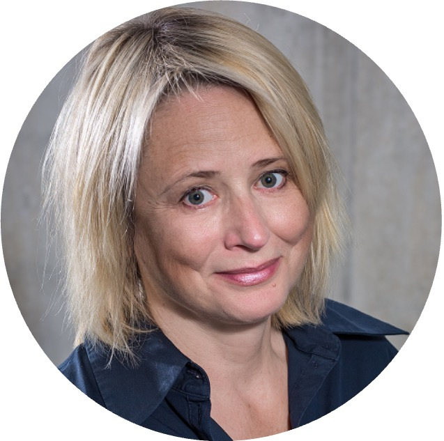

# **Zespół**

<section style="padding: 2rem 0; background-color: #f9f9f9;">
  

    <!-- Karta osoby -->
  

      
      <h3 style="color: #422B6F; margin: 0;">Prof. UW dr hab. Katarzyna Śledziewska</h3>
      
Dyrektorka Zarządzająca DELab UW, Kierowniczka Katedry Transformacji Technologicznej na Wydziale Nauk Ekonomicznych Uniwersytetu Warszawskiego. Specjalistka w dziedzinie zmian organizacyjnych i wdrażania innowacji cyfrowych. Bada kompetencje przyszłości na zmieniającym się rynku pracy oraz przemiany wynikające z wdrażania rozwiązań opartych na AI w przedsiębiorstwach i organizacjach. Jest Certyfikowaną Practitioner i Master Practitioner NLP, posiadającą międzynarodowe certyfikaty IANLP i IN, a także ukończyła kursy MBA. 

  

   
  

      
      <h3 style="color: #422B6F; margin: 0;">Grażyna Szabuniewicz</h3>
      
Certyfikowana Coach Kognitywna Life & Business, Praktyk i Master NLP , Trener NLP, właścicielka firmy coachingowej mindShift point.Ma bogate doświadczenie biznesowe z 25 letnią praktyką zarówno w dużych firmach FMCG będących leaderami na rynku,  jak i MŚP na stanowiskach menedżerskich w obszarach sprzedaży i marketingu.
      Specjalizuje się w budowaniu strategii biznesowych dla menedżerów i właścicieli MŚP, wyznaczaniu celów i ich realizacji kładąc duży nacisk na zmianę przekonań i nabywanie nowych kompetencji.

    

  

      
      <h3 style="color: #422B6F; margin: 0;">Prof. UW dr hab. Renata Włoch</h3>
      
Dyrektorka Naukowa DELab UW, Kierowniczka Katedry Socjologii Cyfrowej na Wydziale Socjologii UW. Specjalizuje się w badaniach nad transformacją cyfrową organizacji, zmianami na rynku pracy i w systemie edukacji. Autorka licznych raportów i ekspertyz dla biznesu oraz instytucji publicznych, posiadająca szerokie doświadczenie w analizie procesów globalizacyjnych i cyfrowych.

    

  
  

      
      <h3 style="color: #422B6F; margin: 0;">Dr Agnieszka Pugacewicz</h3>
      
Specjalistka zarządzająca obszarem Entrepreneurship & Academia, prowadzi badania nad gospodarką cyfrową oraz innowacyjnymi sektorami. Jej zainteresowania obejmują otwartość danych publicznych i naukowych, współpracę interdyscyplinarną, rozwój startupów, przedsiębiorczość oraz transfer wiedzy między uczelniami a biznesem. Aktywnie wspiera organizacje pozarządowe – społeczne, prawne i kulturalne – działając w ich zarządach. Jej doświadczenie to idealne wsparcie dla firm poszukujących innowacyjnych rozwiązań oraz skutecznej współpracy ze środowiskiem akademickim i pozarządowym.

  

  

      
      <h3 style="color: #422B6F; margin: 0;">Dominik Jankowski</h3>
      
Kierownik projektów EEN. Ekspert w zakresie innowacji, internacjonalizacji oraz wsparcia dla sektora MŚP. Certyfikowany konsultant IMP³rove – narzędzia służącego ocenie zdolności firm do zarządzania innowacjami.
      Swoje doświadczenie zdobywał m.in. w Uniwersyteckim Ośrodku Transferu Technologii Uniwersytetu Warszawskiego, gdzie realizował projekty finansowane z funduszy strukturalnych, Programu Ramowego na rzecz Konkurencyjności i Innowacji (CIP) oraz 7. Programu Ramowego UE. Jego bogata wiedza i praktyczne podejście czynią go zaufanym partnerem w rozwoju innowacyjności i konkurencyjności firm na rynku krajowym i międzynarodowym.

    

  
  

      
      <h3 style="color: #422B6F; margin: 0;">Tomasz Krawczyk</h3>
      
Ekspert w analizach finansowych i umiędzynarodowieniu biznesu. Doktor nauk ekonomicznych specjalizujący się w ekonometrii finansowej, rynkach kapitałowych i modelowaniu ryzyka w projektach inwestycyjnych. W ramach EEN wspiera przedsiębiorstwa w ekspansji na rynki zagraniczne, ocenie wartości niematerialnych i prawnych, a także w analizach biznesowych i finansowych. Jego doświadczenie obejmuje wsparcie w obszarze umiędzynarodowienia biznesu oraz rozwoju innowacji produktowych, procesowych i usługowych.

  

  
  

      
      <h3 style="color: #422B6F; margin: 0;">Wojciech Nowakowski</h3>
      
Ekspert w transformacji cyfrowej i umiędzynarodowieniu biznesu. Specjalista wspierający firmy w ramach projektu Enterprise Europe Network. Posiada bogate doświadczenie w doradztwie związanym z transformacją cyfrową oraz ekspansją na rynki zagraniczne. Jako wieloletni przedsiębiorca, doskonale rozumie wyzwania i potrzeby firm, co pozwala mu skutecznie wspierać ich rozwój oraz pomagać w osiąganiu międzynarodowych sukcesów.

    

  

</section>

 

<i>
#FunduszeUE
</i>
